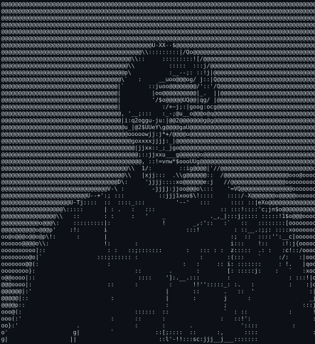

  

  <picture>
    <source media="(prefers-color-scheme: dark)" srcset="dark_mode-cropped.svg">
    <source media="(prefers-color-scheme: light)" srcset="light_mode-cropped.svg">
    
  </picture><picture>
    <source media="(prefers-color-scheme: dark)" srcset="dark_mode(det)-cropped%20(1).svg">
    <source media="(prefers-color-scheme: light)" srcset="light_mode(nondet)-cropped%20(1).svg">
    
  </picture>

